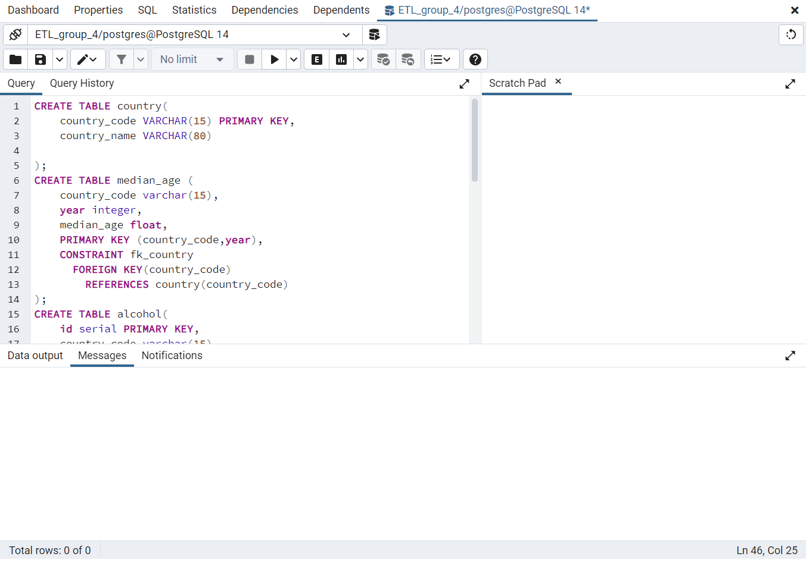

# ETL Project – Group 4
Authors: Dat Nguyen, Robert McDonald, Jason Butt

## Introduction
This document is a report detailing how we **E**xtracted, **T**ransformed, and **L**oaded (ETL) some data that we believed may pertain to road traffic deaths around the world into a database.

- - -
## **E**xtraction
We used 4 different datasets from the [World Health Organisation (WHO)](https://www.who.int/data/gho/), the [World Bank](https://data.worldbank.org/), and [Our World in Data](https://ourworldindata.org/). We searched for the most useful data that we believed could be used to investigate road traffic deaths across the world and extracted the data from .csv files from these sources. The data in the files included the following information for each country:

* GDP per capita in USD

* Median age

* Average number of litres of alcohol (as pure ethanol) drunk per person per year

* Estimated road traffic death rate per 100,000 people

### Sources:
* [Income Measured by GDP per capita](https://data.worldbank.org/indicator/NY.GNP.PCAP.PP.CD)
* [Median Age](https://ourworldindata.org/grapher/median-age)
* [Alcohol Consumption](https://www.who.int/data/gho/data/themes/topics/topic-details/GHO/levels-of-consumption)
* [Traffic Deaths](https://www.who.int/data/gho/data/indicators/indicator-details/GHO/estimated-road-traffic-death-rate-(per-100-000-population))

- - -
## **T**ransformation
### First step:
We first created a new .csv file that contains all of the country names (country.csv) and country codes used throughout the 4 data files.\
The other .csv files were each loaded into pandas and unnecessary columns were removed from the data frames. For each file:

### GDP:
#### Columns that were kept:
* 'Country Code' *which was renamed to* 'country_code'
* All of the year columns were also kept

#### Cleaning:
* The year columns were transposed into a single new column of years using the pandas df.melt() method
* NaN values were dropped using df.dropna()

### Median Age:
#### Columns that were kept:
* 'Type of aggregate, group, and constituents *' *which was renamed to* 'country_name'
* All of the year columns were also kept

#### Cleaning:
* The dataframe was merged with the data from country.csv to add a column of Country Codes which were missing from the inital Median Age dataset
* The original data included extrapolations to the year 2100, so we dropped all columns past 2020
* The 'country_name' column was then dropped since this dataframe now had a 'country_code' column

### Alcohol Consumption:
#### Columns that were kept:
* 'SpatialDimensionValueCode' *which was renamed to* 'country_code'
* 'TimeDim' *which was renamed to* 'year'
* 'DisaggregatingDimension1ValueCode' *which was renamed to* 'alc_type'
* 'Value' *which was renamed to* 'alc_num', *containing the data on alcohol consumption in litres*

No further cleaning was required since this dataframe was now in the correct format

### Traffic Deaths:
#### Columns that were kept:
* 'SpatialDimValueCode' *which was renamed to* 'country_code'
* 'Period' *which was renamed to* 'year'
* 'FactValueNumeric' *which was renamed to* 'deaths_per_100k'

No further cleaning was required since this dataframe was now in the correct format

- - -
## **L**oading
* We first made a connection to a Postgres server using pgAdmin and created a database to store this data.\
* We then ran a query to create our tables (see all_dbs.sql).

* For each file, we created a connection in the ETL-Project.ipynb notebook using the sqlalchemy package and loaded each pandas dataframe into the tables created above.

* We initially had trouble creating Foreign keys to link the tables together. This problem was eventually solved when we realised that some of the tables contained more Country Codes than the 'country' table which contains the Primary key, leading us to merge all country names and country codes from all tables to recreate country.csv.

### Entity Relationship Diagram (ERD)
